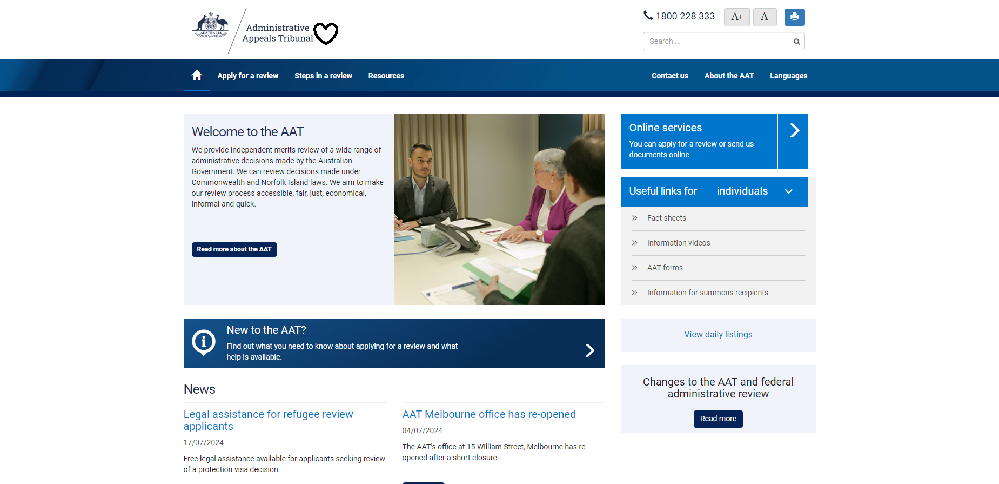

# AAT Chat Widget Demo

This project demonstrates the implementation of a chat widget on a simulated Administrative Appeals Tribunal (AAT) website.

## Screenshot



## HTML Code

Here's the HTML code used to create this demo:

```html
<!DOCTYPE html>
<html lang="en">
<head>
    <meta charset="UTF-8">
    <meta name="viewport" content="width=device-width, initial-scale=1.0">
    <title>Chat Widget Test with AAT Website Background</title>
    <style>
        body, html {
            margin: 0;
            padding: 0;
            height: 100%;
            overflow: hidden;
        }
        #background-image {
            position: fixed;
            top: 0;
            left: 0;
            width: 100%;
            height: 100%;
            background-image: url('Screenshot 2024-07-17 150808.png');
            background-size: cover;
            background-position: center;
            background-repeat: no-repeat;
            z-index: -1;
        }
    </style>
</head>
<body>
    <div id="background-image"></div>

    <script v2 id="Microsoft_Omnichannel_LCWidget" src="https://oc-cdn-public-oce.azureedge.net/livechatwidget/scripts/LiveChatBootstrapper.js" data-app-id="71728c61-46a5-4671-945e-1f14763a8c81" data-lcw-version="prod" data-org-id="96e1117d-2540-ef11-a311-0022489629cb" data-org-url="https://m-96e1117d-2540-ef11-a311-0022489629cb.au.omnichannelengagementhub.com"></script>
</body>
</html>
